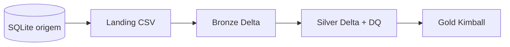

# Arquitetura Medalhão

A arquitetura **Medalhão** organiza o lakehouse em camadas com qualidade crescente dos dados.

## Camadas

| Camada | Formato | Responsabilidade neste projeto |
|--------|---------|--------------------------------|
| **Landing** | CSV no Volume `workspace.landing.dados` | Cópia bruta extraída do SQLite |
| **Bronze** | Delta (`workspace.bronze`) | Histórico bruto + `data_hora_bronze`, `nome_arquivo` |
| **Silver** | Delta (`workspace.silver`) | Padronização de nomes (`CODIGO_`, `DATA_`, etc.) e auditoria |
| **Gold** | Delta (`workspace.gold`) | `dim_carro`, `dim_cliente`, `dim_localidade`, `dim_tempo`, `fato_sinistro` |

## Domínio

Dados sintéticos de **seguros automotivos**: clientes, apólices, veículos, sinistros e hierarquia geográfica (município → estado → região).
